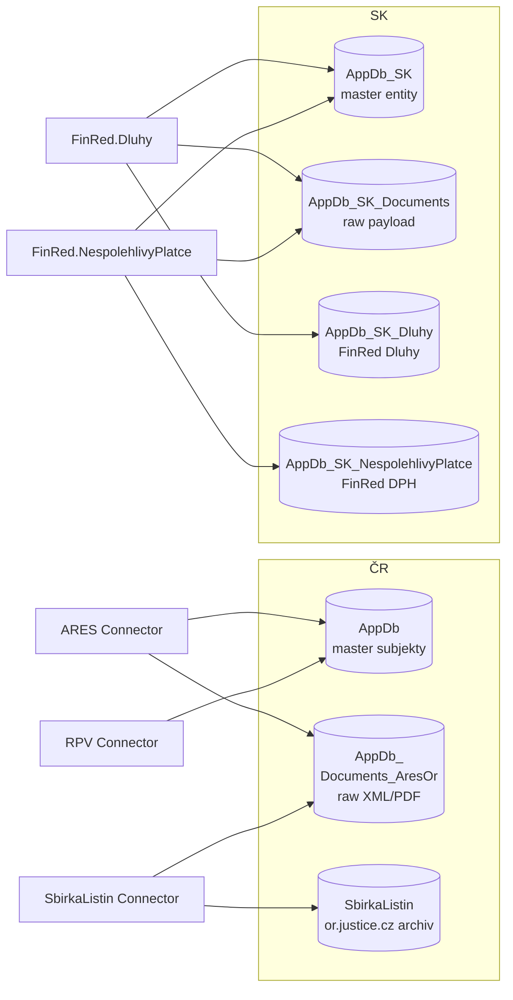

# DB modeling — schémata, cross-DB topologie, konvence

## Mapa databází v ekosystému connectorů



> **Poznámka:** Toto je logická mapa odvozená z analýzy connectorů. Konkrétní per-connector topologie je v `stored-procedures.md` daného connectoru.

## Konvence pojmenování

| DB | Konvence tabulek | Konvence SP | Příklad |
|---|---|---|---|
| `AppDb` | snake_case | `<entity>s_<Action>By<Key>` (mix camel/snake) | `subjects`, `subjekts_CreateNewSubjectByIc` |
| `AppDb_Documents_AresOr` | PascalCase | PascalCase | `Documents`, `SaveSourceDocumentToDB` |
| `AppDb_SK*` | PascalCase | `skFinRed_*` (camelCase prefix) | `Documents`, `skFinRed_Documents_SetStatus` |
| `SbirkaListin` | snake_case | mixed | `sl_archiv`, `sl_archiv_*` |

> **Konzistence > preference.** Když přidávám nový SP do `AppDb`, držím konvenci `subjekts_` (i když je to typo „k" místo „c") — kontextová konzistence vyhrává nad ortografií.

## Standardní sloupce a vzory

### Soft-delete pattern (`datum_do IS NULL` = aktivní)
AppDb používá pro historizaci adres, názvů, statutárních zástupců.
```sql
CREATE TABLE subjects_adresy (
    id_adresa INT IDENTITY PRIMARY KEY,
    id_subject INT NOT NULL FOREIGN KEY REFERENCES subjects(id_subject),
    ulice NVARCHAR(255),
    -- ...
    datum_od DATETIME NOT NULL,
    datum_do DATETIME NULL,  -- NULL = aktivní záznam
);

-- Aktivní adresa subjektu:
SELECT * FROM subjects_adresy WHERE id_subject = @id AND datum_do IS NULL;
```

### Audit sloupce
| Sloupec | Typ | Účel |
|---|---|---|
| `vlozeno` / `inserted` / `created_at` | `DATETIME DEFAULT GETDATE()` | Vznik záznamu |
| `last_check` / `updated_at` | `DATETIME` | Poslední dotyk connectorem |
| `id_zdroj_dat` / `zdrojeDat_id` | `INT` | Reference na číselník zdrojů |
| `id_run` | `INT/UNIQUEIDENTIFIER` | Reference na ProcessInstance run |

### Hash deduplikace dokumentů
```sql
CREATE TABLE Documents (
    id_document INT IDENTITY PK,
    hash_payload VARBINARY(32),  -- SHA256 raw XML
    payload_zip VARBINARY(MAX),  -- gzip-ed XML
    UNIQUE (hash_payload)
);
```
Pattern: connector spočítá hash, dotáže DB, pokud existuje → skip insert (jen update status).

## Klíčové enumerace (číselníky napříč DB)

### `zdrojeDat_id` (AppDb)
| ID | Zdroj | Connector |
|---|---|---|
| 1 | ARES ES | `Connector.Ares.API.Downloader.EkonomickeSubjekty` |
| 2 | ARES VR | `Connector.Ares.API.Downloader.VR` |
| 12 | ARES Notifikace | `Connector.Ares.API.Downloader.Notifikace` |
| ... | ... | (kompletní výčet patří do `database-model.md` per connector) |

### Task states
Konkrétní hodnoty per-connector v `database-model.md`. Standardní enum (z `BaseConnector`):
- `0 = NEW`, `1 = DOWNLOADING`, `2 = DOWNLOADED`, `3 = PARSED`, `4 = SAVED`, `5 = DONE`, `9 = FAILED`, `99 = DEAD`

### Document status
Per-connector. Vzor z SK.NespolehlivyPlatce — viz `stored-procedures.md`.

## Cross-DB problémy a vzory

### 1. Entita v master DB, dokumenty v storage DB
Vzor: `AppDb.subjects` ↔ `AppDb_Documents_AresOr.Documents`
```sql
-- Master ID je integer, FK je v storage DB:
SELECT d.* FROM AppDb_Documents_AresOr.dbo.Documents d
WHERE d.id_subject_appdb = @id_subject;
```
Bez FK constraint mezi DB — integrita zajištěna v aplikaci.

### 2. Trigger update napříč DB
Vzor: SK.NespolehlivyPlatce — trigger archivace `BussInfo` při změně.
**⚠️ Anti-pattern:** triggery napříč DB jsou křehké (deadlock potenciál, MSDTC issues). Standard preferuje explicitní volání SP z aplikace.

### 3. Side-efekt SP ⚠️
Vzor anomálie: `skFinRed_Documents_SetStatus` updatuje **`AppDb_SK_Dluhy`** místo `AppDb_SK_Documents` (chybný název cílové tabulky v SP).
**Pravidlo:** každý SP musí mít v komentáři **explicit:** „CÍL: `[AppDb_SK_Documents].[dbo].[Documents]`" — pak je odchylka okamžitě viditelná v code review.

## Šablona pro nový `database-model.md` connectoru

Viz `templates/connector-docs/database-model.md.tmpl`. Sekce:
1. Přehled DB (které, role)
2. ER diagram per DB
3. Tabulky (název, sloupce s typy, PK/FK, indexy)
4. SP (kompletní výčet — name, IN/OUT, mutated tables, callees)
5. Skalární / tabulkové funkce
6. Triggery
7. Enumerace
8. Zdroj snapshotu (datum, výstup `DbIntrospect snapshot`)

## Kde najít existující DDL snapshoty

| Connector | Cesta | Datum |
|---|---|---|
| ARES (AppDb, AppDb_Documents_AresOr) | `Connectors/Connector.Ares.API/docs-connectors/db-structures/_scripts/01–04*.sql` | snapshot z generační doby ARES |
| SbirkaListin | `Connectors/Connector.CZ.SbirkaListin_Archiv/src/.../docs/_scripts/01_sl_archiv_tables.sql + 02_*_procedures.sql` | 2026-04-24 |
| Ostatní | ❌ chybí — generovat přes `DbIntrospect snapshot` |

## Doporučený workflow pro DB analýzu

1. **Spusť snapshot:** `dotnet run --project tools/DbIntrospect -- snapshot --db <DBName> --out ./snapshots/<date>/`
2. **Vygeneruj `database-model.md`:** ze snapshotu + šablony.
3. **Diff vs. minulý snapshot:** detekce neoznámených změn schématu (nový sloupec, smazaný index).
4. **Update `enumerace`:** ručně doplnit význam pro číselníky (číselné hodnoty CLI nezná).
5. **Cross-link s `stored-procedures.md`:** SP tabulka v SP dokumentu odkazuje na sekci v DB modelu.
