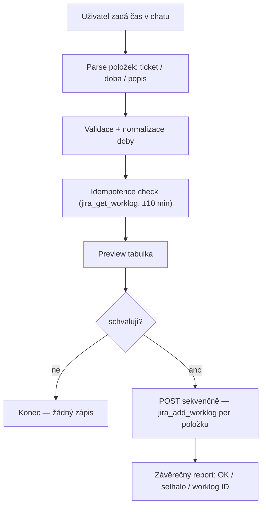

# Worklog — vykazování času do Jiry

Profil vykazuje čas do Jiry **z chatu** — žádný Excel. Workflow řídí skill [`/worklog`](../.claude/skills/worklog/SKILL.md).

## Základní pravidlo

> **Jedna činnost = jeden Jira worklog.** Worklogy se NIKDY neslučují — ani stejný ticket, ani stejný den.

Důvod: granularita time trackingu po jednotlivých činnostech (viz [`feedback_jira_worklog_format`](../.claude/memory/feedback_jira_worklog_format.md)). Kombinovaný blok per den ničí přehled, který si uživatel v Jiře vede.

## Workflow



## Použití

```
vykázat čas: 2h CONN-142 ladění parseru, 30m CONN-150 review PR, 1h porady
```

- **Aktivace** — `/worklog` nebo fráze „vykázat čas" / „vykaž … hodin".
- **Datum** — default dnešní; jeden běh = jeden den. Zpětně: „vykázat čas za 2026-05-15: …".
- **Doba** — `2h`, `1h 30m`, `30m`, `0.5h`, `90m` → normalizace na Jira `time_spent`.
- **`started`** — stoupající od `08:00` (override `--start-time HH:mm`), aby timeline v Jira worklog UI dával smysl.
- **Idempotence** — worklog se shodnou dobou a `started` v rámci ±10 min se označí jako duplikát a přeskočí.

## Gates

- **Žádný zápis bez explicitního `schvaluji`** ([`feedback_no_jira_writes`](../.claude/memory/feedback_no_jira_writes.md)). Souhlas je per dávka, ne trvalé zmocnění.
- **Žádné slučování položek** — žádné `doba_celkem = SUM()`.
- **Žádný edit / delete** existujícího worklogu — duplikát se jen přeskočí a oznámí.
- Pojistka: hook `validate-worklog.ps1` (PreToolUse) varuje na pipe / středník v `comment` — typický příznak kombinovaného worklogu.

## Měsíční export (účetnictví)

Pro účetnictví existuje opt-in export worklogů zpět do Excelu:

```
pwsh tools/worklog-export.ps1 -Month 5 -Year 2026
```

Stáhne přes Jira REST všechny worklogy přihlášeného uživatele za měsíc → `WS_<MĚSÍC>_<ROK>.xlsx`.

- Vyžaduje env vars `JIRA_URL` / `JIRA_USERNAME` / `JIRA_TOKEN` (viz [`getting-started.md`](getting-started.md)).
- Vyžaduje modul `ImportExcel` — jediná Excel závislost v profilu: `Install-Module ImportExcel -Scope CurrentUser`.
- Cílový adresář: env var `WORKLOG_XLSX_DIR` nebo parametr `-OutDir`.

Export je **opt-in** — pro denní vykazování není potřeba, to plně pokrývá skill `/worklog`.
