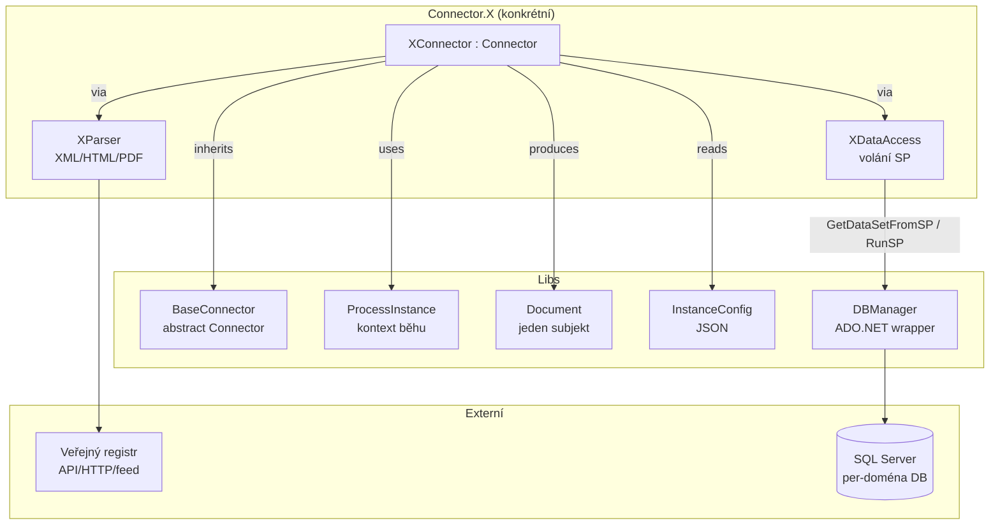
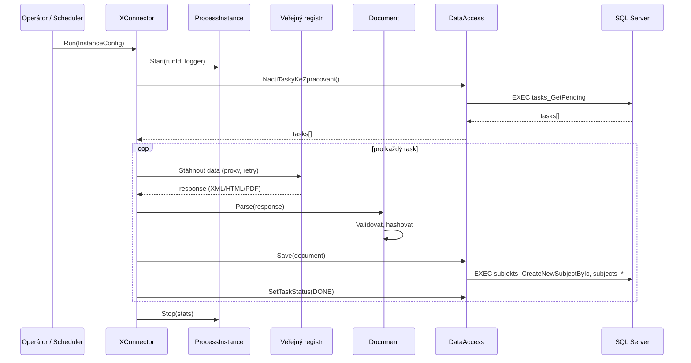
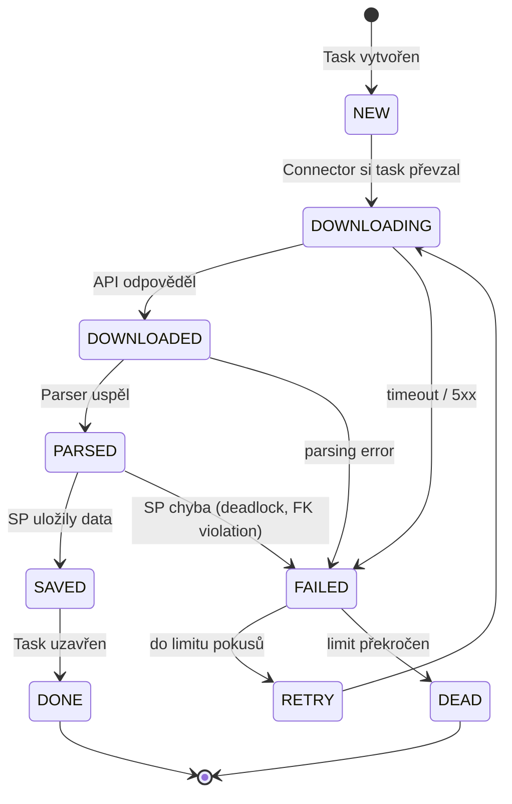

# Anatomie connectoru — `BaseConnector`, `ProcessInstance`, `Document`, `Task`

## Architektura na vysoké úrovni



## Lifecycle jednoho běhu connectoru



## Klíčové třídy z `BaseConnector` (Libs)

| Třída | Cesta | Role |
|---|---|---|
| `Connector` (abstract) | `Libs/BaseConnector/.../Connector.cs` | Orchestrátor — `Run()`, error handling, logging |
| `ProcessInstance` | `Libs/BaseConnector/.../ProcessInstance.cs` | Kontext jednoho běhu (runId, start/stop, statistika, logger handle) |
| `Document` | `Libs/BaseConnector/.../Document.cs` | Reprezentace 1 zpracovaného subjektu (metadata, payload, status) |
| `InstanceConfig` | `Libs/BaseConnector/.../InstanceConfig.cs` | Deserializovaný JSON config (limity, prahy, prostředí) |
| `Task` | `Libs/BaseConnector/.../Task.cs` | Záznam v queue tabulce — co zpracovat, v jakém stavu |
| `TaskError` | `Libs/BaseConnector/.../TaskError.cs` | Chybový stav tasku — error code, message, kdy |

> **Poznámka.** ARES (`Connector.Ares.API`) má vlastní `Connector` v `Downloader.Common`, **nedědí z `BaseConnector`**. Je to historické (vznikl později). Při refaktoringu zvážit migraci, ale nedělat zbytečně.

## Lifecycle Document a Task (state machine)



Konkrétní hodnoty stavů a transition logika jsou per-connector (viz `flow.md` daného connectoru).

## Vzor implementace nového connectoru

```csharp
public class MyConnector : Connector
{
    private readonly MyDataAccess _da;
    private readonly MyParser _parser;

    public MyConnector(InstanceConfig config) : base(config)
    {
        _da = new MyDataAccess(config.ConnectionString);
        _parser = new MyParser();
    }

    public override void Run()
    {
        using var pi = new ProcessInstance(this);
        var tasks = _da.GetPendingTasks();

        foreach (var task in tasks)
        {
            try
            {
                var raw = DownloadFromApi(task);
                var doc = _parser.Parse(raw);
                _da.Save(doc);
                _da.SetTaskStatus(task.Id, TaskStatus.Done);
            }
            catch (Exception ex)
            {
                _da.LogTaskError(task.Id, ex);
                _da.SetTaskStatus(task.Id, TaskStatus.Failed);
            }
        }
    }
}
```

## Kde co najít v reálných connectorech (pro inspiraci)

| Hledám | Otevři |
|---|---|
| Vzor implementace `Run()` | `Connector.CZ.RejstrikPravnichOsob/src/.../Connector.cs` |
| Dual-view refactoring (původní + optimalizovaný) | `Connector.SK.FinRed.Dluhy/src/.../docs/analysis.md` (CONN-200) |
| Alternativní režim běhu (jeden vs. transactional) | `Connector.SK.FinRed.NespolehlivyPlatce/src/.../Run()` + `RunOneTransaction()` |
| Task distributor / paralelizace | `CoreFramework` (black-box) — volání v ARES `Downloader.Common` |
| HTML scraping pattern | `Connector.CZ.SbirkaListin_Archiv/src/.../Parser.cs` |
| PDF parsing pattern | `Connector.SK.FinRed.Dluhy/src/.../PdfParser.cs` |

## Časté pasti

| Past | Kde se objevuje | Mitigace |
|---|---|---|
| **Cross-DB transakce** | SK.NespolehlivyPlatce updatuje 3 DB | Buď MSDTC (komplikované), nebo per-DB transakce s kompenzací. Standard: per-DB. |
| **`GETDATE()` vs. `DateTime.Now`** | SbirkaListin (anomálie) | Volba musí být konzistentní per task — datum ID je v C#, datum DB záznamu má být `GETDATE()`. |
| **SP volaný s null parametrem** | AppDb má SP s `@param = NULL OUTPUT` | Vždy zkontrolovat, jestli je `@output` typu OUTPUT a parametr má `Direction = ParameterDirection.Output` v C#. |
| **Idempotence při opakovaném běhu** | všechny | Hash dokumentu se ukládá → pokud existuje s tímto hash, skip insert (nebo update jen status). |
